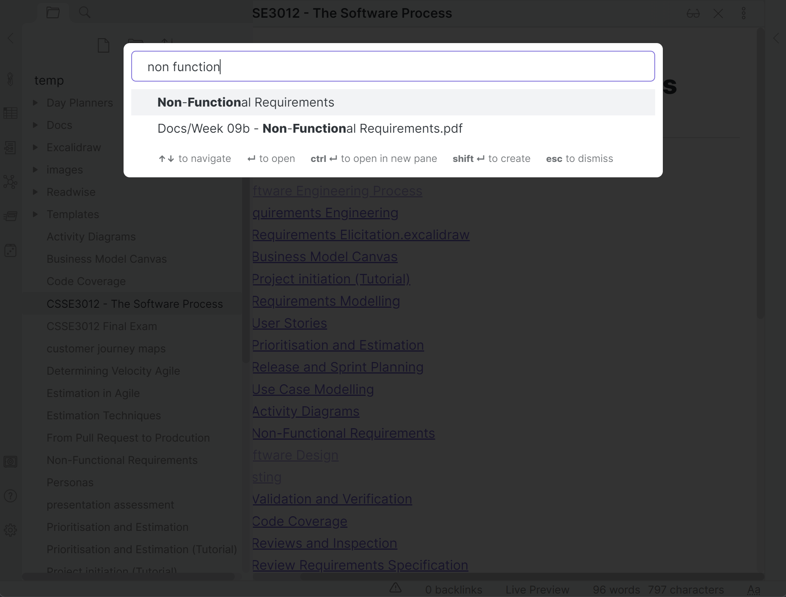

# CSSE 3012 Notes
Quickly search for information in open-book tests

### Usage
- Fork the repo and clone it
- Download **Obsidian.md**
- Open **Obsidian**. Select **open folder as vault** and open this repo
- !! **Turn Off Safe Mode** so that community plugins can be used

___

### Useful commands
- `Ctrl + O` to search files by filename
- `Ctrl + P` to open the command palette

___
