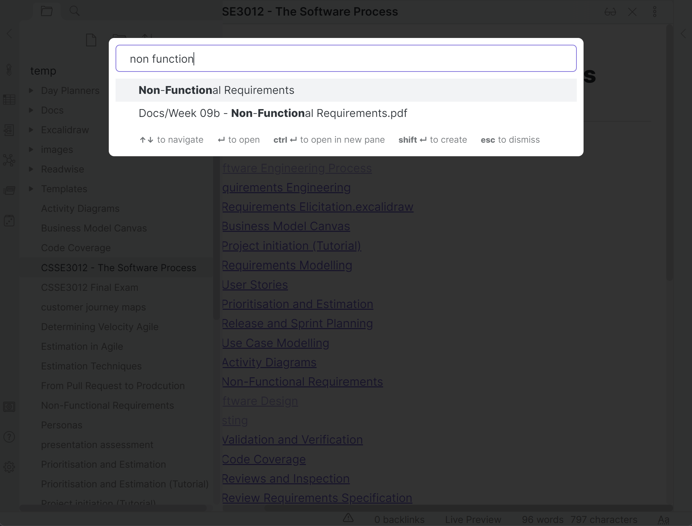

# CSSE 3012 Notes
Quickly search for information in the subject. Better understanding and knowledge retention.

### Usage
- Fork the repo and clone it
- Download **Obsidian.md**
- Open **Obsidian**. Select **open folder as vault** and open this repo
- **!! Turn Off Safe Mode** so that community plugins can be used

___

### Useful commands
- `Ctrl + O` to search files by filename
- `Ctrl + P` to open the command palette

___
### Useful Tips
- Search for **docs/...** to quickly access all material of all weeks

- Access the **Graph View** to get an idea of the weightage of a topic (*More connections likely correlate to higher weightage*)

- Open the local graph using `Ctrl + P` -> `Open Local Graph` to get a visual idea of the subtopics of a topic

___
